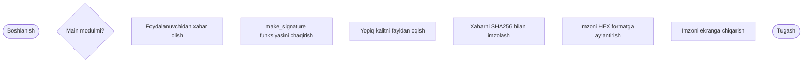

# o-rinboyeva-gulrabo-kibrxavfsizlik
``mermaid
flowchart TD
    A([Boshlanish])
    B{Main modulmi?}
    C[Foydalanuvchidan xabar olish]
    D[Foydalanuvchidan imzo olish]
    E[check_signature funksiyasini chaqirish]
    F[HEX imzoni baytga aylantirish]
    G[Ochiq kalitni fayldan oqish]
    H[Imzoni tekshirish]
    I{Imzo togri mi?}
    J[Imzo togri degan xabar]
    K[Imzo notogri degan xabar]
    Z([Tugash])
```





  ```mermaid
flowchart TD
    A([Boshlanish])
    B{Main modulmi?}
    C[Foydalanuvchidan xabar olish]
    D[Foydalanuvchidan imzo olish]
    E[check_signature funksiyasini chaqirish]
    F[HEX imzoni baytga aylantirish]
    G[Ochiq kalitni fayldan oqish]
    H[Imzoni tekshirish]
    I{Imzo togri mi?}
    J[Imzo togri degan xabar]
    K[Imzo notogri degan xabar]
    Z([Tugash])
```
